# TrueDeal Project

## About

It is a project which will return real product information from amazon. User can create shopping list and can add fav/hate to the database.

## Deployment at heroku link

This project is deployed by heroku. You can click the link below to open it:

https://true-deal-2021.herokuapp.com/

## Goal

(It is a capstone one project for full stack webdevelopment.)

### Return price/description/reviews

- return apple product price/description from amazon.
- give users log in and let user creates their own shoppinglist.
- record users favotite items, and hated items.

## Table of Content

- Home: return product by search term
- Search-by-Asin: return result by product asin
- Review-By-Asin: return reviews by product asin
- Shopping-list: load users' shopping list
- profile: show user's profile
- login/logout

## User Persona

- Basic everyday user who wants to know what price for product will qualify for true deal, otherwise it will be a fake promo.
  All ages.
- Location: amazon/walmart user.
- User need: get the lowest price.

## Main functions

- search by keyword (support all markets)

- search by asin (search all markets)

- reviews by asin (search all markets)

- add/edit shoppinglist

- add favorite, add hate items

## User Flow

- user can log in to view their shoppinglists, and save favorite, hate, and seach itesms.

## Technologies Used

- HTML
- CSS
- Bootstrap
- Font-awesome
- Google fonts
- JAVASCRIPT
- PYTHON
- SQL
- SQLACHLMY
- FLASK
- FLASK-FORM
- Github
- and more

## UI

- The theme is more coloful, and childish stylish. Using minic, naive, fun colors.
- google fonts: Fraunces
- color story:
  purple rgb(161, 116, 204), blue(0,0,255), white, green

## API

(This API I choose from RapidApi)

- Amazon Product/Reviews/Keywords API Documentation

- https://rapidapi.com/logicbuilder/api/amazon-product-reviews-keywords

- Product Search (GET)
- Product review ( GET)
- Product description (GET)

## Using bootstrap to responsive

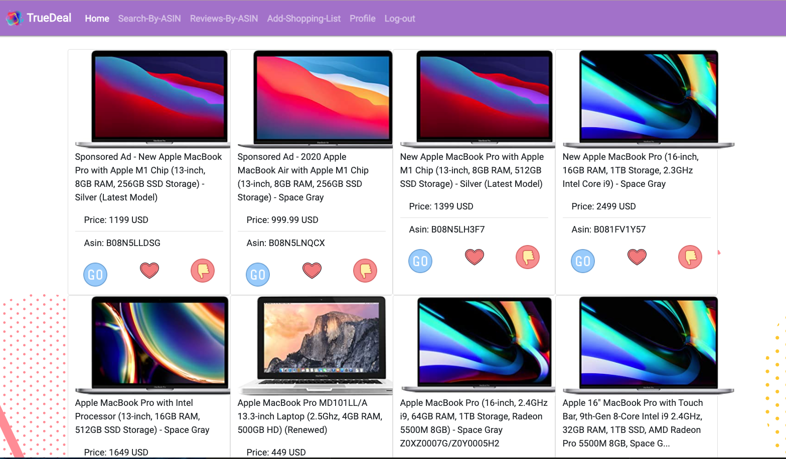
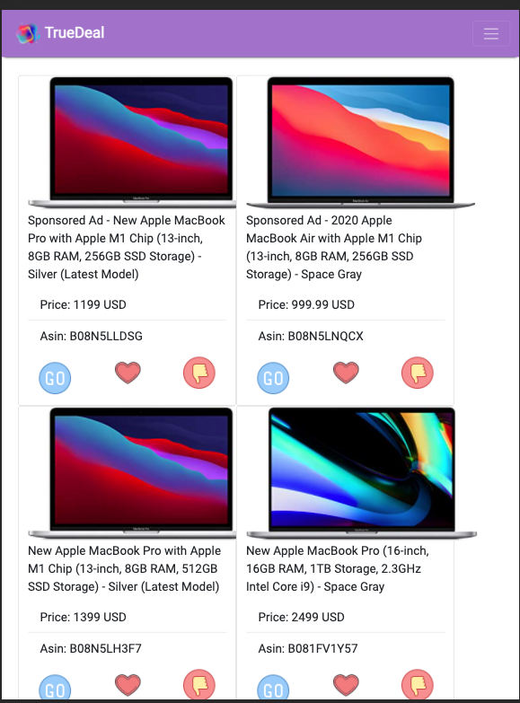
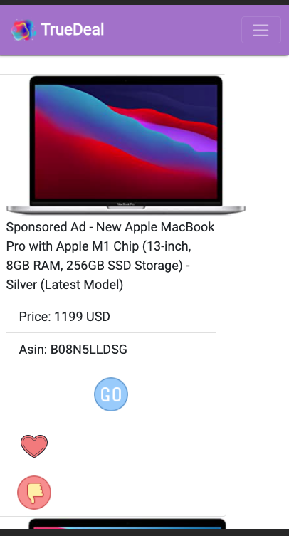

## Schema Design

- amazon: id-a, name, price, review, description

- user login : user_id, username,password,profile-img,shoppinglist
- shopping list: id, content, done, username

- relation table 1:
  user-amazon-favorite

- relation-table 2:
  user-shopping-list

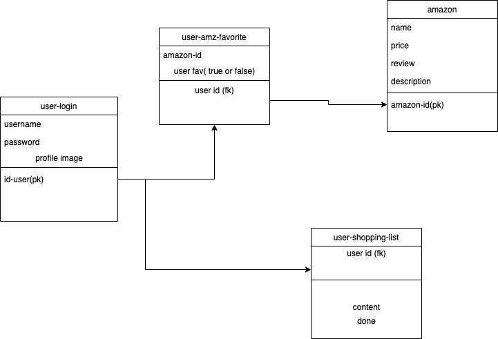

## Simple Mockup

# search by keyword

# search result and you can go to amazon page, like it or hate it

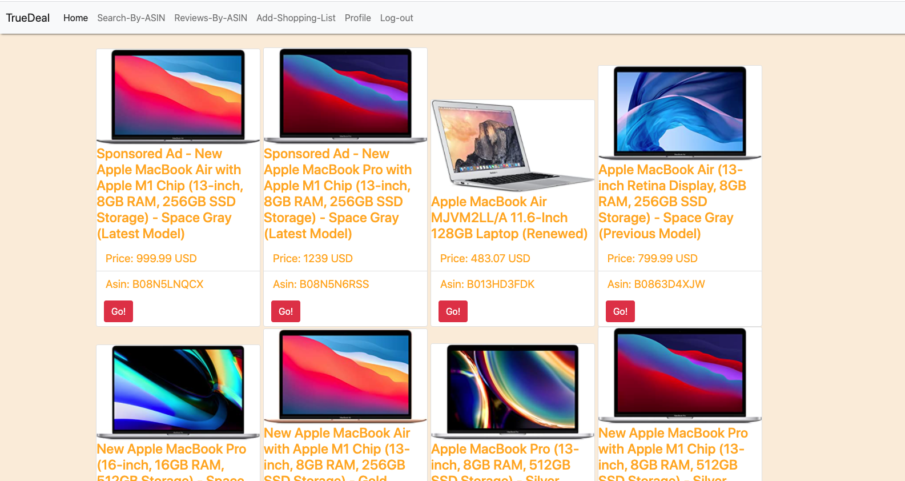

# search by asin

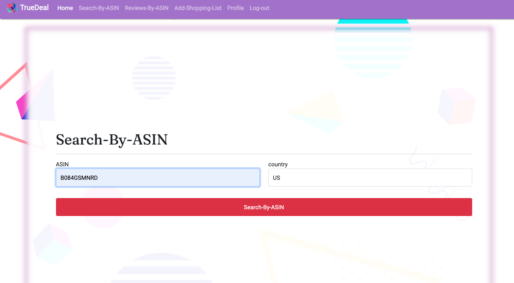

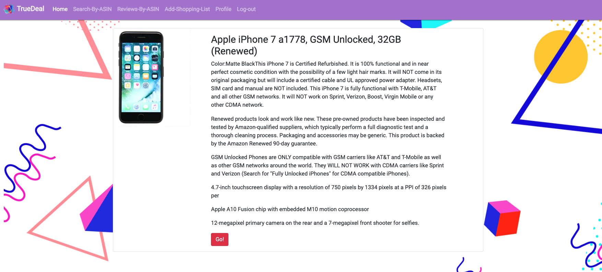

# review by asin

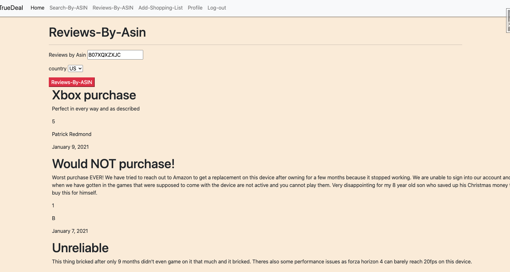

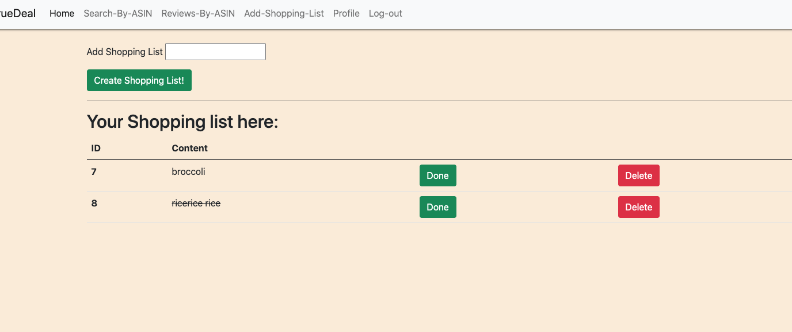

# create shopping list

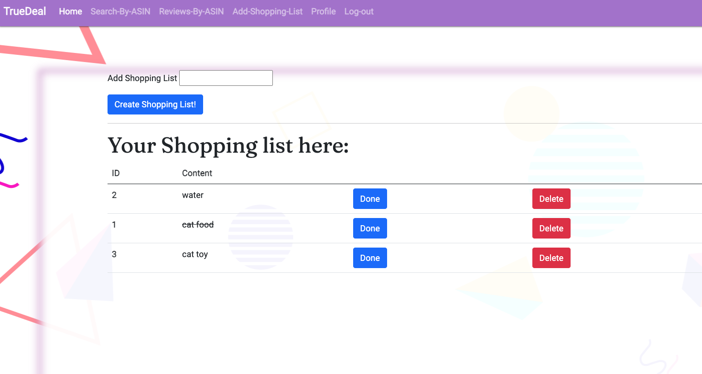

## user profile page

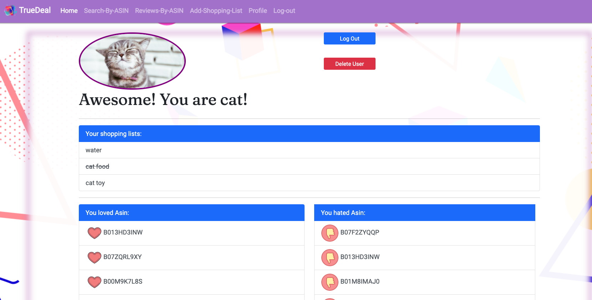

## user love or hate asin lists

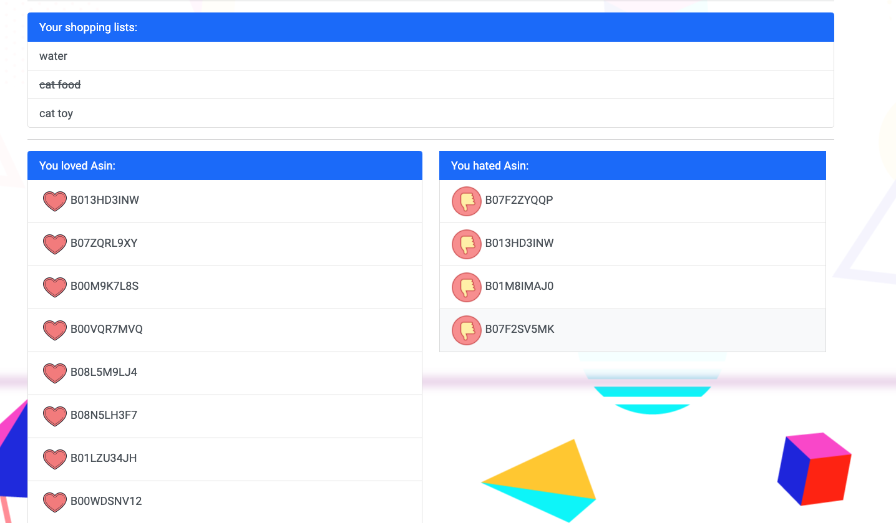
