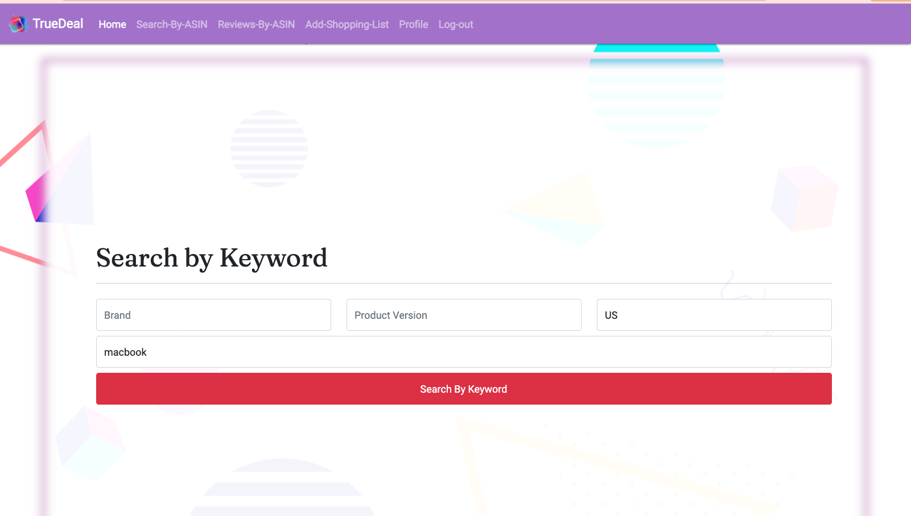

#TrueDeal Project

##Deployment at heroku link

https://true-deal-2021.herokuapp.com/

##Goal

###Return price/description/reviews

- return apple product price/description from amazon.
- give users log in and let user creates their own shoppinglist.
- record users favotite items, and hated items.

##Sample User
- username: cat
- password: cat

##User Persona
 
-  Basic everyday user who wants to know what price for product will qualify for true deal, otherwise it will be a fake promo.
All ages. 
- Location:  amazon/walmart user.
- User need: get the lowest price.

## Main functions

- search by keyword (support all markets)

- search by asin (search all markets)

- reviews by asin (search all markets)

- add/edit shoppinglist

- add favorite, add hate items

##User Flow

- user can log in to view their shoppinglists, and save favorite, hate, and seach itesms.

##Coding Languages

- HTML, CSS, JAVASCRIPT, PYTHON, SQL,SQLACHLMY, FLASK, FLASK-FORM and more

##UI
- The theme is more coloful, and childish stylish.
- google fonts
- color story: purple, blue, white, green

## API

(This API I choose from RapidApi)

- Amazon Product/Reviews/Keywords API Documentation

- https://rapidapi.com/logicbuilder/api/amazon-product-reviews-keywords

- Product Search (GET)
- Product review ( GET)
- Product description (GET)

##Schema Design

- amazon: id-a, name, price, review, description

- user login : user_id, username,password,profile-img,shoppinglist
- shopping list: id, content, done, username

- relation table 1:
user-amazon-favorite

- relation-table 2:
user-shopping-list

##Simple Mockup
#search by keyword

#search result and you can go to amazon page, like it or hate it

#search by asin

#review by asin

#create shopping list

## user profile page

##user love or hate asin lists

