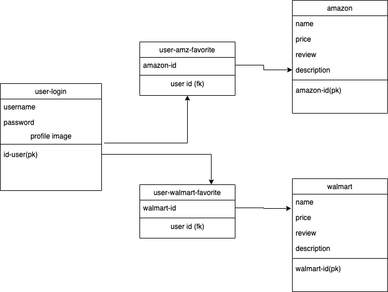

#TrueDeal Project 

##Goal

- return product price/description from amazon and walmart.
- combine amazon review,walmart review and give the product review rating.

##User Persona
 
-  Basic everyday user who wants to know what price for product will qualify for true deal, otherwise it will be a fake promo.
All ages. 
- Location: US marketplace, amazon/walmart user.
- User need: get the lowest price.

## API
- amazon price/description:

https://english.api.rakuten.net/ebappa1971/api/amazon-price/endpoints

https://rapidapi.com/axesso/api/axesso-amazon-data-service1

https://rapidapi.com/axesso/api/axesso-amazon-data-service1?endpoint=5c420736e4b0cc6cdc0edc7f

https://rapidapi.com/logicbuilder/api/amazon-product-reviews-keywords

- walmart price/description:
 https://developer.walmartlabs.com/docs?ref=apilist.fun

##Schema Design
- user search bar (it will have brand,category(optional),product name, version(optional). Every search will have a search id.
- amazon: id-a, name, price, review, description
- walmart: id-w,name,price,review,description

- user login : id-user, username,password,profile-photo

- relation table 1:
user-search id 

- relation-table 2:
search id-- id-a --id-w

