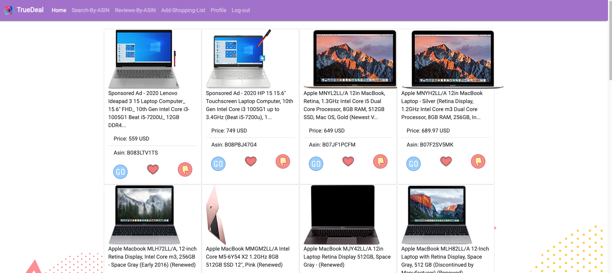
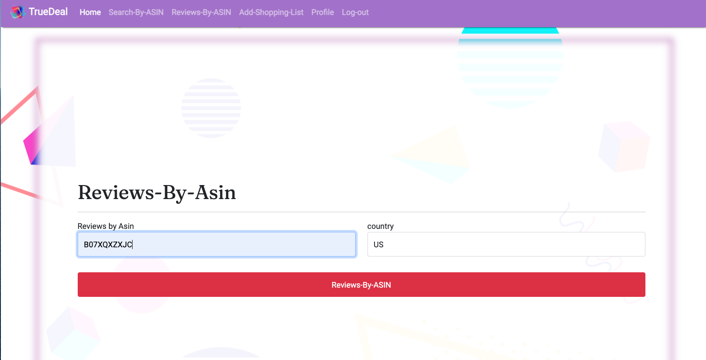
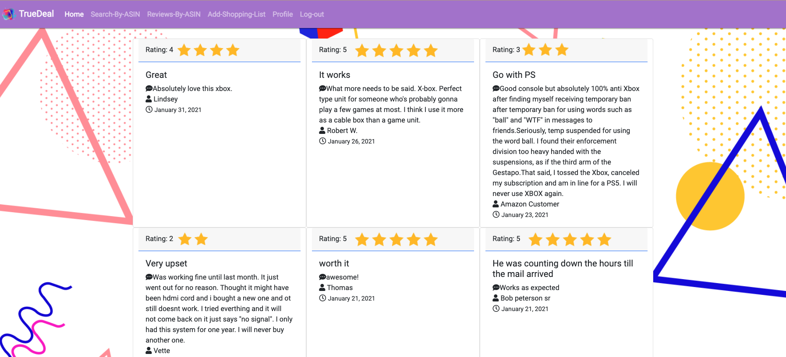

#TrueDeal Project 

##Goal

###Return price/description/reviews

- return apple product price/description from amazon.
- give users log in and let user creates their own shoppinglist.

##User Persona
 
-  Basic everyday user who wants to know what price for product will qualify for true deal, otherwise it will be a fake promo.
All ages. 
- Location:  amazon/walmart user.
- User need: get the lowest price.

## Main functions

- search by keyword

- search by asin

- reviews by asin

- add/edit shoppinglist

- add favorite(to be conintued)

## API
- Amazon Product/Reviews/Keywords API Documentation

- https://rapidapi.com/logicbuilder/api/amazon-product-reviews-keywords

- Product Search (GET)
- Product review ( GET)
- Product description (GET)

##Schema Design

- amazon: id-a, name, price, review, description

- user login : user_id, username,password,profile-img,shoppinglist
- shopping list: id, content, done, username

- relation table 1:
user-amazon-favorite

- relation-table 2:
user-shopping-list

##Simple Mockup
#search by keyword

#search by asin

#review by asin

#profile and shopping list

